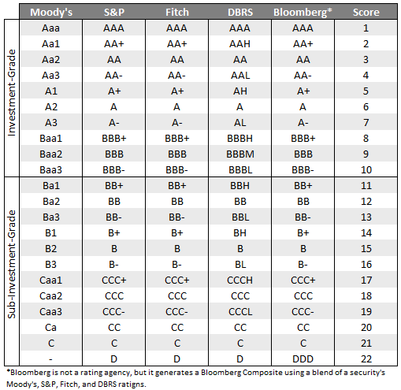

# Long-term ratings

A credit rating is an evaluation of the credit risk of a prospective debtor (an 
individual, a business, company or a government), predicting their ability to pay 
back the debt, and an implicit forecast of the likelihood of the debtor defaulting. 
The credit rating represents an evaluation of a credit rating agency of the 
qualitative and quantitative information for the prospective debtor, including 
information provided by the prospective debtor and other non-public information 
obtained by the credit rating agency's analysts.[^1]

**pyratings** supports the four main rating agencies, namely

- Moody's
- Standard & Poors
- Fitch
- DBRS

The rating scales of each of these rating agencies differ only slightly (see table 
below). 
**pyratings** also supports Bloomberg ratings, whereby Bloomberg isn't an actual 
rating agency. However, Bloomberg provides a composite rating, which is a blend of 
Moody's, S&P's, Fitch's, and DBRS' rating for a particular security.

When working with ratings, you will get to a point where you need to do some 
"computations". For example, comparing different ratings across different agencies 
makes it necessary to translate human-readable ratings into numerical rating scores. 
It's always easier to compare numbers rather than plain text. The following table shows 
all ratings including equivalent rating scores.

[^1]: [https://en.wikipedia.org/wiki/Credit_rating](https://en.wikipedia.org/wiki/Credit_rating)
