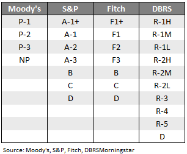
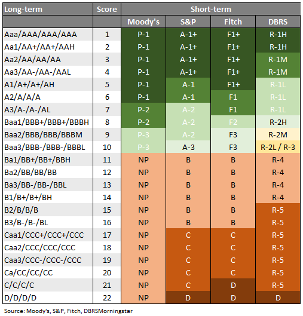
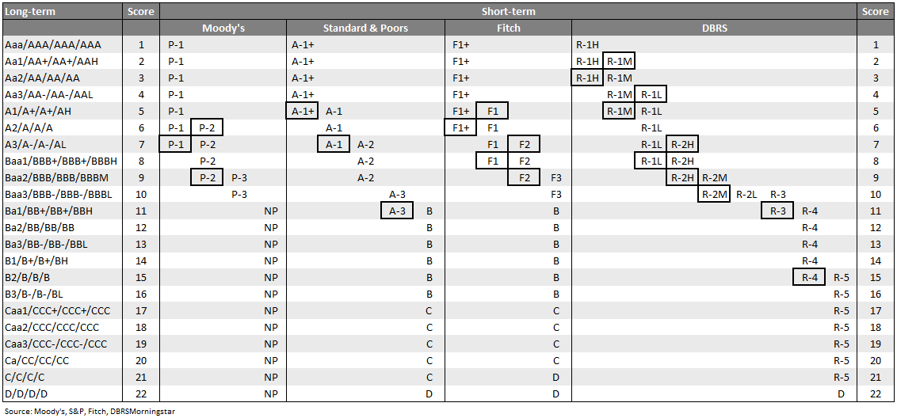
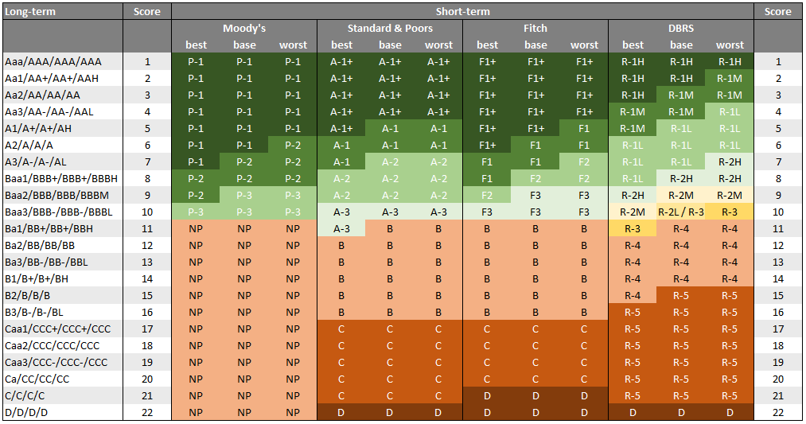

# Short-term ratings
Rating agencies publish short-term ratings in order to express a company's ability 
to repay debt that matures within the next twelve months. A rating scale 
representing short-term ratings looks somewhat different compared to a long-term 
rating scale. Also, the rating scales differ when compared across different rating 
agencies.

## Rating scales
When looking at the short-term rating scales, S&P and Fitch are quite comparable. 
However, Moody's and especially DBRS's rating scales are different. 
This makes it hard to compare short-term ratings across agencies.

## Comparing ratings
Let's say we want to compute the average short-term rating across all securities 
within a portfolio. As a matter of fact, most of the time, not all securities in 
a portfolio do possess a short-term rating from one particular rating agency. If you 
are lucky, all securities might have at least one short-term rating, but potentially 
from different rating agencies. While security A might have a rating from S&P and 
Fitch, security B and C might have a rating from Moody's or DBRS, if at all.

If we were talking about long-term ratings, the path to go seems clear:

- Translate the ratings into numerical rating scores
- Compute the sum-product of the individual security weights and the rating scores
- Translate the outcome back to a human-readable rating.

With short-term ratings, it's not that easy. The reason is the difference in rating 
scales. These differ in length, which means even if we attach a rating score to a 
particular rating, the scores are not comparable among different rating agencies.

Now, one way to solve that problem is to take into consideration that a company's 
short-term rating has a tight relationship with its long-term rating. The different 
rating agencies describe this relationship as follows:

The main idea is to determine an equivalent long-term rating score 
for every short-term rating. It's probably best to use an example to show what it 
looks like.

Taking Moody's rating scale, it is obvious that a short-term rating of P-1 is 
equivalent to a long-term rating between Aaa and A2. Or, to express it in terms of 
equivalent long-term rating scores, a rating of P-1 is equivalent to long-term 
rating scores between 1 and 6. Going with S&P, an A-1+ rating has an equivalent 
long-term rating score between 1 and 4.

To compare ratings across agencies, we need a clear-cut relationship between the 
human-readable rating and its corresponding rating score. Something like having a 
score between 1 and 6 isn't helpful at all. So, what to do? 
We could take the average of the rating scores and assign this **average
equivalent value (AEV)** to the respective short-term rating. For Moody's, a P-1 rating
will have assigned an AEV of 3.5 (average of 1 and 6). An A-1+ rating would be
equivalent to an AEV of 2.5 (average of 1 and 4).

Once you assign a concrete short-term rating score (AEV) to every security in your 
portfolio, your problem has basically been solved. From here on, the process is the 
same as when working with long-term ratings.

## There's one more catch...
All rating agencies' work with some overlaps in their rating scales. For example, 
Moody's usually assigns a short-term rating of P-1 to an A2-rated company. However, 
Moody's reserves itself the right to assign a short-term rating of P-2, if the 
rating agency concludes that the liquidity situation of this particular company is not 
compatible with a P-1 rating. In other words, even if this company has been rated A2 
from a long-term perspective, there might be some issues that the company has to 
deal with during the next twelve months and these issues might have greater risks 
attached to it.  
On the flip side, consider a company with an A3 rating. It would usually get 
assigned a rating of P-2. However, there might be situations where the rating agency 
concludes that the liquidity outlook is somewhat better, which justifies the 
assignment of a P-1 short-term rating.

Different rating agencies have different overlapping areas. Here's the full picture:

Well, now we have a problem. Let's say you have a long-term rating score of 6. 
What's the correct short-term rating? — The answer is: You can't tell. It could be 
P-1 or P-2 (in terms of Moody's). Having said this, P-1 is still the most likely 
outcome. 
Anyway, at that stage, you have to make up your mind and take a decision. Remember, 
there's no right or wrong, just different ways of getting the job done.

**pyratings** offers three distinct strategies in order to translate a long-term 
rating score into a short-term rating.

- Strategy 1 (best): 
  You always choose the best possible short-term rating. In the case of a rating 
  score of 7, that would translate into a short-term rating of P-1. 
  That's the optimistic approach.
- Strategy 2 (base): 
  You always choose the short-term rating that a rating agency would usually assign 
  if there aren't any special liquidity issues (positive or negative). In that case, 
  a rating score of 6 translates into a P-1 rating, while a rating score of 7 would 
  translate into a P-2 short-term rating. 
  That's the base-case approach.
- Strategy 3 (worst): 
  You always choose the worst possible short-term rating. In the case of a rating 
  score of 6, that would translate into a short-term rating of P-2. 
  That's the conservative approach.

**pyratings**'s default strategy is _strategy 2 (base)_ as it is probably the 
best fit for most situations.

Here's a summary of all possible translations depending on the chosen strategy.

One of the advantages of using different strategies is to avoid any overlapping 
ranges. Every short-term rating has a one-to-one relationship with an equivalent 
long-term rating. This makes the translation from a human-readable rating into a 
rating score a clear-cut.
